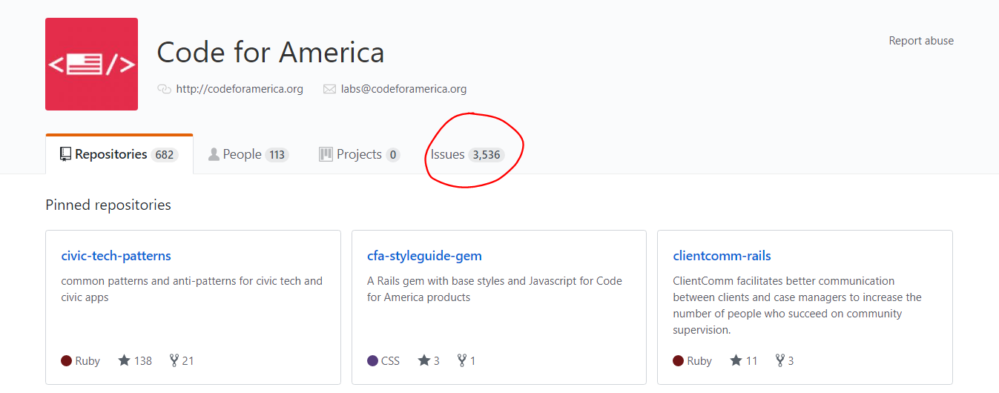

# GitHub Organization Issues Link

A browser extension that adds an *Issues* tab that lets you browse all issues across a GitHub organization's repos.

- [**Add to Firefox**](https://addons.mozilla.org/en-US/firefox/addon/github-org-issues-link/)
- [**Add to Chrome**](https://chrome.google.com/webstore/detail/github-organization-issue/apjhcnanjlebginfefonhmnammmmplma)

## Attributions

- Images for the extension icon: [Emoji One](https://www.emojione.com/)
